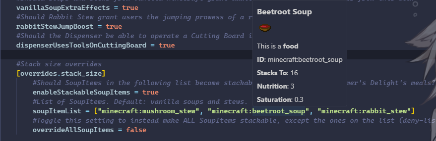
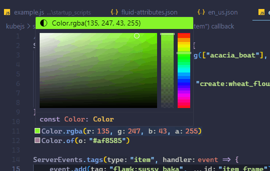

# ProbeJS (Extension)

This is an VSCode extension for ProbeJS to display rich information for items, fluids and translations.

Also includes some other features like color picking.

## Features

- Display rich information for items, including item type (tool, weapon, etc), food value, saturation, translated name, stack size and so on. Triggered by hovering over an item string, like `"minecraft:stone"`.
- Display what items are under a tag. Triggered by hovering over a tag string, like `"#minecraft:stone"`.
- Display rich information for fluids, including fluid texture, having bucket/block and translated name. Triggered by hovering over a fluid string, like `"minecraft:water"`.
- Display information for translations, `en_us` and currently selected language, as well as other languages having a similar region code will be displayed. Triggered by hovering over a translation string, like `"block.minecraft.stone"`.
- Color picking for `Color.of` and `Color.rgba`. When `Color.` is typed, it will also show a color picker for shorthanding.

## Examples

